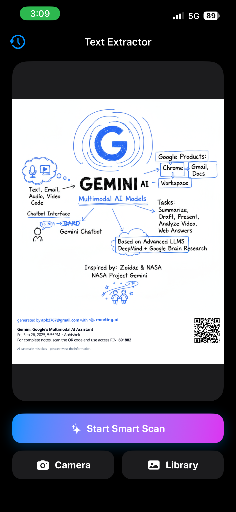
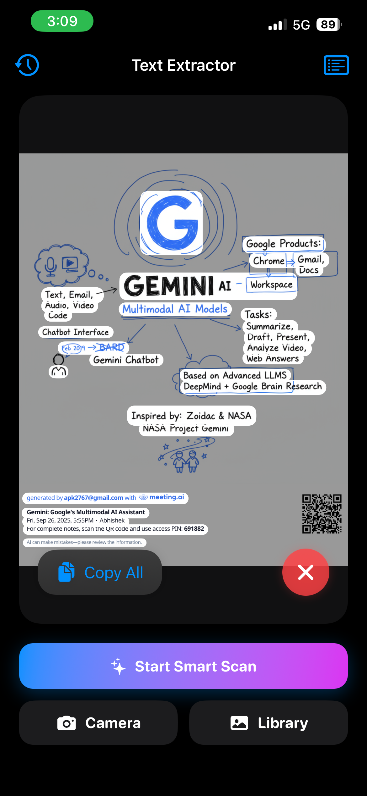

# 📱 ImageTextExtractor

A premium iOS app that extracts text from images using Apple's Vision framework with a stunning, modern interface featuring glassmorphism overlays and intelligent text grouping.

## ✨ Features

### Core Functionality
- 📸 **Dual Input Methods**: Capture photos directly with camera or select from photo library
- 🔍 **Smart Text Detection**: Advanced OCR using Apple's Vision framework with accurate text recognition
- 🎯 **Live Scan Mode**: Interactive overlay that highlights detected text areas in real-time
- 👆 **Tap-to-Copy**: Instantly copy any text snippet with a single tap
- 📋 **Copy All**: Grab all detected text at once
- 🔄 **Share Integration**: Share extracted text via Messages, Mail, or other apps
- 📜 **Scan History**: Automatically saves your last 50 scans for easy access
- 💾 **Persistent Storage**: History is saved locally and persists across app sessions

### Premium Design
- 🌈 **Gradient UI**: Beautiful blue-to-purple gradients throughout the interface
- ✨ **Glassmorphism Effects**: Modern blur overlays with translucent backgrounds
- 🎭 **Smooth Animations**: Spring-based animations for a fluid user experience
- 📳 **Haptic Feedback**: Tactile response for all interactions
- 🎨 **Dark Mode Support**: Automatically adapts to system appearance
- 🚀 **Progress Indicators**: Real-time scanning feedback with loading states

## 📸 Screenshots

<p float="left">
  
  
</p>

## 🔧 Requirements

- iOS 15.0+
- Xcode 16.0+
- Swift 5.9+

## 🚀 Installation

```bash
git clone https://github.com/Abhishek6353/ImageTextExtractor.git
cd ImageTextExtractor
open ImageTextExtractor.xcodeproj
```

### ⚠️ Important: Camera Permission

Before running the app, add camera usage description to your `Info.plist`:

**Key**: `NSCameraUsageDescription`  
**Value**: `We need access to your camera to scan and extract text from images in real-time.`

## 📖 How to Use

1. **Launch the App** - You'll see a clean welcome screen
2. **Choose Input Method**:
   - Tap **Camera** to take a new photo
   - Tap **Library** to select an existing image
3. **Start Smart Scan** - Tap the gradient "Start Smart Scan" button
4. **Interactive Text Selection**:
   - Text areas will be highlighted with a glassmorphic overlay
   - Tap any highlighted area to copy that specific text
   - Use **Copy All** button to grab everything
5. **View History** - Tap the clock icon (top-left) to access previous scans
6. **Share Results** - Use the share icon in results view to export text

## 🛠 Technologies

- **SwiftUI**: Modern declarative UI framework
- **Vision Framework**: Apple's machine learning-powered text recognition
- **PhotosUI**: Native photo picker integration
- **UIImagePickerController**: Camera capture functionality
- **Canvas & Blend Modes**: Advanced rendering for text overlays
- **UserDefaults**: Local persistence for scan history

## 🏗 Architecture

The app follows a clean, modular architecture:

- `ContentView.swift`: Main UI and scan orchestration
- `CameraPicker.swift`: Camera capture wrapper
- `HistoryManager.swift`: Persistent storage manager
- `ImageViewWithOverlays.swift`: Live scan visualization
- Custom button styles and components for premium aesthetics

## 🎨 UI/UX Highlights

- **Intelligent Text Grouping**: Nearby text snippets are automatically combined
- **Responsive Feedback**: Instant visual and haptic feedback on all actions
- **Truncated Previews**: Long text is intelligently shortened in alerts
- **Accessibility**: Follows iOS best practices for VoiceOver support

## 📝 License

MIT License - feel free to use this project however you'd like!

## 🤝 Contributing

Pull requests are welcome! Here are some ideas for contributions:
- Multi-language support
- Export to PDF/Word
- Batch image processing
- Custom text formatting options
- QR code detection

## 🙏 Acknowledgments

Built with inspiration from modern iOS design patterns and powered by Apple's Vision framework.

---

⭐ **Star this repo if you find it useful!**

Made with ❤️ by [Abhishek6353](https://github.com/Abhishek6353)
